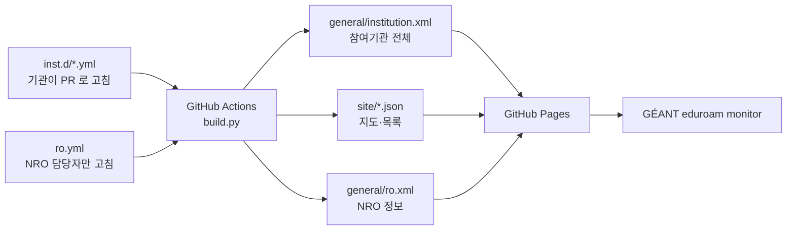

# eduroamKR database 📇

대한민국 eduroam 참여기관 관리 데이터베이스


## 활용

1. [글로벌 eduroam 모니터링 사이트](https://monitor.eduroam.org)에 한국 서비스 현황 데이터 제공
2. [대한민국 eduroam 공식 웹사이트](http://eduroam.kreonet.net)에 서비스 현황 데이터 제공


## 기관 정보 신규 등록하기

1. 이 저장소를 fork 합니다.
2. [`inst.d/_example.re.kr.yml`](inst.d/_example.re.kr.yml) 을 복사해 `inst.d/<기관realm>.yml` 로 만듭니다.

    ```
    inst.d/sample.re.kr.yml
    ```

3. 내용을 기관 정보에 맞게 고칩니다. 각 항목의 의미는 예시 파일 주석에 있습니다.
4. 기관 로고를 `logo/<기관realm>.png` 로 추가합니다. `svg` `jpg` `gif` 도 됩니다.
5. Pull Request 를 보냅니다.

PR 을 열면 GitHub Actions 가 YAML을 XML 을 빌드하고 공식 XSD 로 검증합니다. 초록불이면 그대로 병합됩니다. 빨간불이면 어느 줄이 왜 틀렸는지 로그에 나옵니다.

병합되면 몇 분 안에 아래 URL 이 갱신되고, GÉANT eduroam monitor 가 이 데이터를 수집합니다.


## 기관 정보 수정하기

1. 이 저장소를 fork 합니다.
2. 오류가 있는 내용을 수정합니다.
3. Pull Request 를 보냅니다.


## 서식 맞추기

PR 을 올리기 전에 한 번 돌리면 항목 순서·들여쓰기·따옴표가 저장소 서식으로 맞춰집니다.

```sh
python3 bin/lint-yaml.py --fix
```

PR 에서 GitHub Actions 가 같은 검사를 하고, 어긋나면 빨간불이 납니다. 값은 건드리지 않고 모양만 바꿉니다.


## 정보 수정 시 유의사항

- **영문(`en`)은 필수입니다.** `name`, `address`, `info_url`, `policy_url`, `loc_name` 은 한국어만 있으면 검증에서 떨어집니다.
- **SP 전용 기관은 `realms` 항목을 통째로 지웁니다.** 빈 목록으로 두지 않습니다.


## CI/CD



PR 을 열면 GitHub Actions 가 XML 을 빌드하고 [공식 XSD](https://monitor.eduroam.org/eduroam-database/v2/docs/eduroam-database-xsd-ver30112021.zip) 로 검증합니다. 초록불이면 그대로 병합된다. 빨간불이면 실패 사유가 로그에 나온다.
